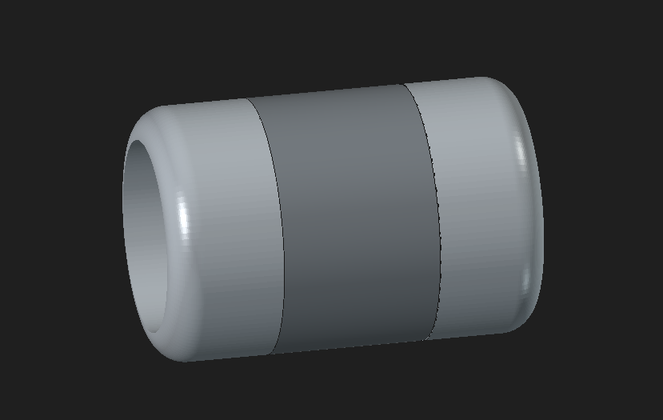
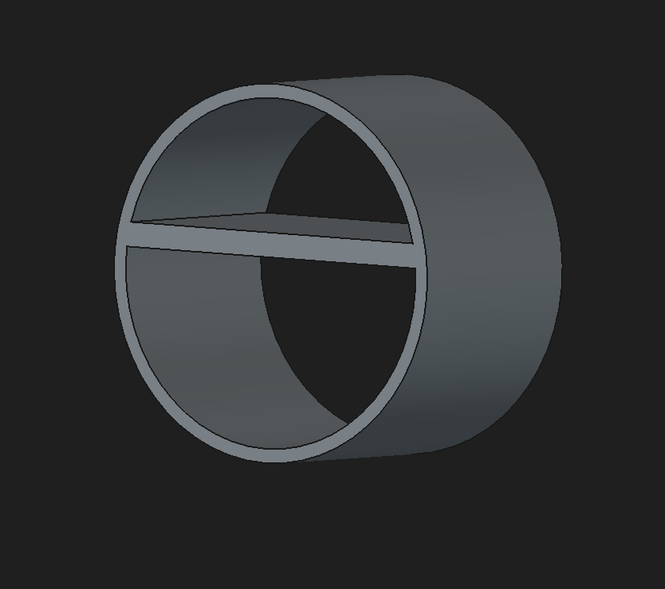
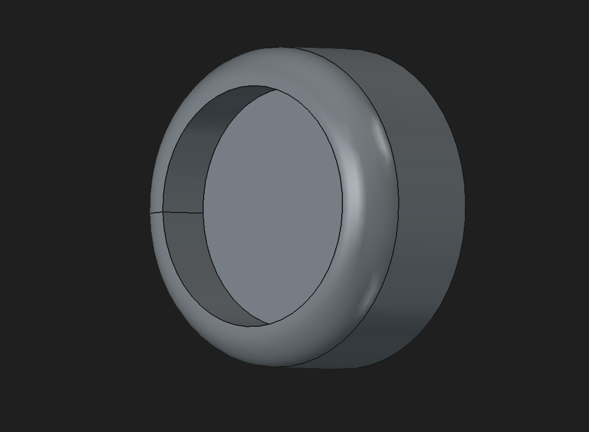

Roller-Bot is literally one of the simplest remote controlled robots i could think of
it should be very easy for anyone to recreate ill leave instructions below
i hope you enjoy making it!

 

  

  

  

  

  

i tried to make this as easy as possible to recreate but im very new to cad (this is my first time using it)
just follow these steps :)

once you have all the parts and pcb's 

1:solder the parts to the reciever pcb (Rollerbot-brain.zip)
2:flash the reciever code onto the esp32 (ROLLERBOT-reciever.ino)
3: mount the pcb on to one side of the flat plate in the middle of the housing using hot glue or however youd like
4: mount the servos on the opposite side of the flat plate using tape or velcro or 3d print glue
5: connect the servos thingie majigs into the holes of each wheel.(you will have to take a wheel off to turn the robot on and off everytime which i know is annoying 😭 but i wanted to keep it very consistent on the outside)
6: solder the parts to the controller pcb (rollerbot-controller.zip)
7: flash the transmitter code onto the controllers esp2 (ROLLERBOT-transmitter.ino)

done! 
